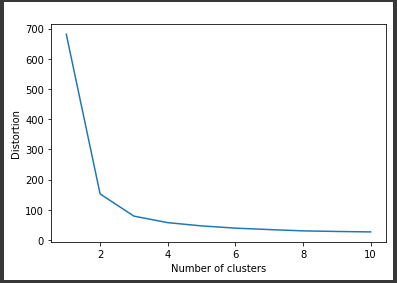

# Supervised Machine Learning

In this project a machine learning maodel was developed to determine the percentage of a student based on the number of study hours.  

## Dataset  

Displaying the first 5 rows of the dataset   
  

### Analysing the dataset   

   

### Checking for any null value in the dataset   

   

### Elbow plot   

This graph helps in determining the optimal number cluster in a dataset. 
It is 3 for this dataset  
   

### Visuallizing clusters in the dataset   

   
